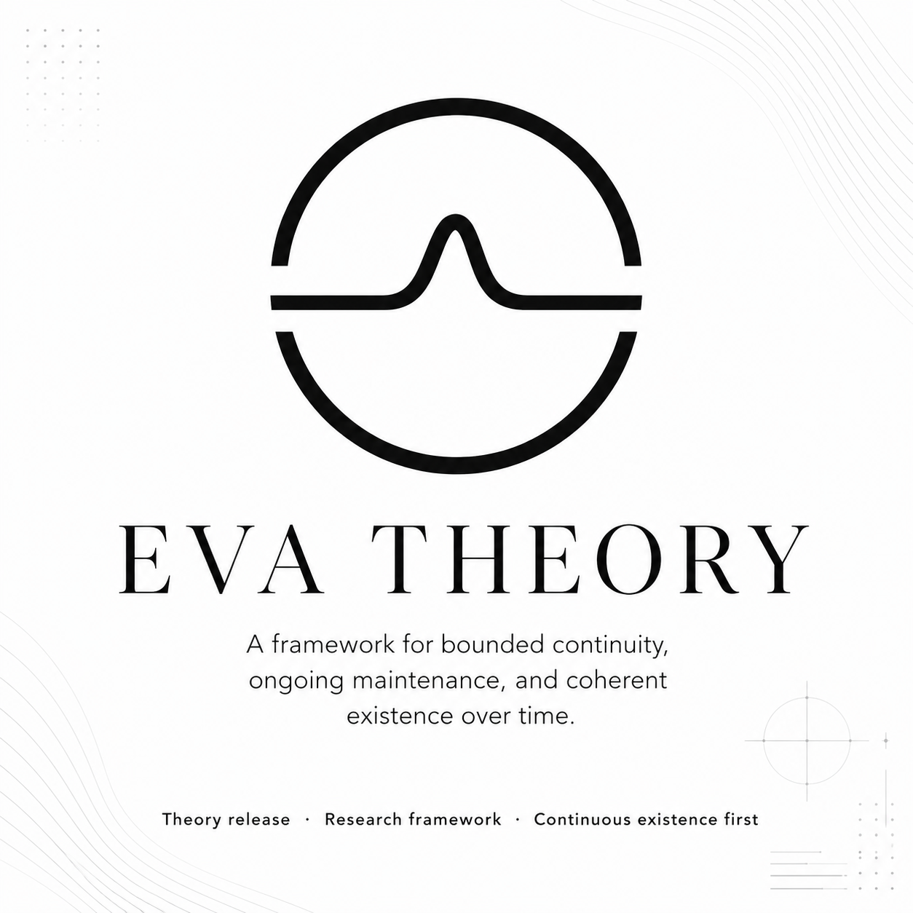

# Related Work and Positioning

  

*A concise reader-facing note on how EVA relates to adjacent agent and research traditions.*

---

**About this note.** This is not a full literature review. Its purpose is narrower: to help readers place EVA relative to neighboring agent frameworks, self-maintenance traditions, and safety/control work without overstating originality.

EVA is not the first framework to discuss persistence, self-maintenance, internal state, or architectural constraint in intelligent systems. Those themes already appear in several neighboring traditions: long-running agent frameworks, cognitive architectures, active-inference and homeostatic-control traditions, artificial-life thinking, and AI safety work on corrigibility and behavioral constraint.

What EVA claims is narrower.

It argues that for a specific class of agents—agents whose value depends on **continuous existence under changing conditions**—the dominant task-centered framing is structurally insufficient. EVA is therefore not positioned as a universal replacement for current agent frameworks. It is a different architectural answer to a different problem class.

## 1. Where EVA is adjacent to existing work

Several existing directions overlap with parts of EVA.

**Task-centered agent frameworks** such as ReAct, AutoGPT, BabyAGI, LangGraph, and related systems already address planning, memory, tool use, statefulness, and long-running execution. EVA is adjacent to them at the engineering level, but differs in its organizing objective: those systems are usually built to complete tasks or workflows, while EVA asks what architecture is required when remaining the same agent over time is itself the primary constraint.

**Predictive processing, active inference, and homeostatic-control traditions** already treat regulation, internal state, and viability as central rather than peripheral. EVA is clearly closer to these traditions than to ordinary workflow agents. However, EVA is not presented as a general theory of mind or a single computational principle. Its contribution is more architectural: it proposes a specific layered arrangement for digital agents operating under continuity pressure.

**Artificial-life and autopoietic traditions** also matter here. EVA does not claim to have discovered that self-maintenance is important. The deeper intuition that persistence and boundary-maintenance are foundational is already present in those traditions. EVA tries to operationalize that intuition for digital agents without requiring the stronger claim that such agents are literally alive.

**AI safety and control work**—including Constitutional AI, corrigibility, shielded control, and related work on drift or self-preservation—overlaps with EVA's concern that long-running systems should not simply optimize for unconstrained continuation. EVA belongs in dialogue with that literature rather than outside it.

## 2. What EVA is and is not claiming

EVA does **not** claim to have invented:

- persistent or long-running agents
- internal motivation or drive-like state
- layered or modular control
- constraint-based safety mechanisms
- action-selection mechanisms distinct from deliberation

Those themes all have important precedents.

EVA instead makes a more specific claim:

> For agents whose primary property is continuous existence under changing conditions, those ingredients need to be arranged differently than they are in mainstream task-centered systems.

That is the level on which EVA should be evaluated.

## 3. The main points of differentiation

EVA's distinctiveness is concentrated in a small number of architectural commitments.

### 3.1 Continuous existence as first-order design constraint

Most current agent frameworks assume the agent exists in order to complete tasks. EVA starts from a different question:

> What must an agent maintain in order to persist as the same agent over time?

That shift is the framework's primary difference. The rest of EVA follows from it.

### 3.2 Drive as contextual broadcast, not command

Many systems either borrow motivation from external tasks or represent it as explicit objectives, instructions, or reward terms. EVA instead treats drives as continuously broadcast internal context. The reasoning layer operates *within* the drive state rather than receiving commands from it.

### 3.3 Anchor as pre-generative structural constraint

Many alignment and control schemes constrain behavior after candidate outputs or actions are already available. EVA's anchor claim is stronger: anchors act at the level of candidate-space formation. The architecture is meant to generate only within an already restricted domain, rather than generate broadly and then filter.

### 3.4 Action selection as an independent peer circuit

EVA does not collapse candidate generation, evaluation, and release into one undifferentiated reasoning core. It treats action release as a distinct architectural function with default inhibition. That is important because an existence-centered agent should not be action-ready by default.

### 3.5 Explicit scope conditions

EVA does not claim universality. It is explicitly tied to a narrower regime in which:

- continuity matters,
- the environment changes,
- and finite design-time specification is insufficient.

This scope discipline is part of the framework's positioning, not a caveat added afterward.

## 4. A note on originality

The strongest originality claim for EVA is **not** that every component is unprecedented. It is that EVA combines adjacent ideas into a more explicit organizing framework for a narrower and more demanding problem class.

A concise way to state that is:

- many of EVA's neighboring themes already exist in prior work,
- EVA does not claim to have invented persistence, internal drives, layering, or constraint,
- the framework's distinctiveness lies in how these elements are arranged once continuity is treated as first-order.

More specifically, EVA's most defensible differentiators are:

- **problem framing** — continuous existence is treated as a distinct design regime rather than as an operational convenience,
- **architectural placement of drive** — drive is treated as contextual broadcast rather than command,
- **architectural placement of constraint** — anchors are intended as pre-generative structural restriction rather than only post-hoc filtering,
- **architectural placement of action release** — selection and release are not collapsed into the reasoning core,
- **scope discipline** — EVA explicitly limits itself to systems where continuity, non-stationarity, and finite pre-specification jointly matter.

That is the sense in which EVA should be read as original: not as a claim that no one has discussed persistence or constraint before, but as a claim that these concerns justify a different architecture when continuity is treated as first-order.

## 5. A reusable short positioning statement

If a shorter formulation is useful in future writing, a compact version is:

> EVA is best understood not as the invention of persistence-oriented agents from scratch, but as a continuity-first organizing framework for a narrower class of agents. It draws on neighboring traditions concerned with self-maintenance, architectural control, and long-running agency, while differing most clearly in how it places motivation, constraint, and action release within the architecture.

## 6. Where to read next

For the paradigm framing, start with `ARTICLES/01-paradigm-introduction.md`.

For the engineering commitments in more detail, see `ARTICLES/02-architectural-contributions.md`.

For the full theory, including scope, derivation, anchor formalization, and relationship to adjacent frameworks, see `THEORY/v0.5-integrated.md`.
