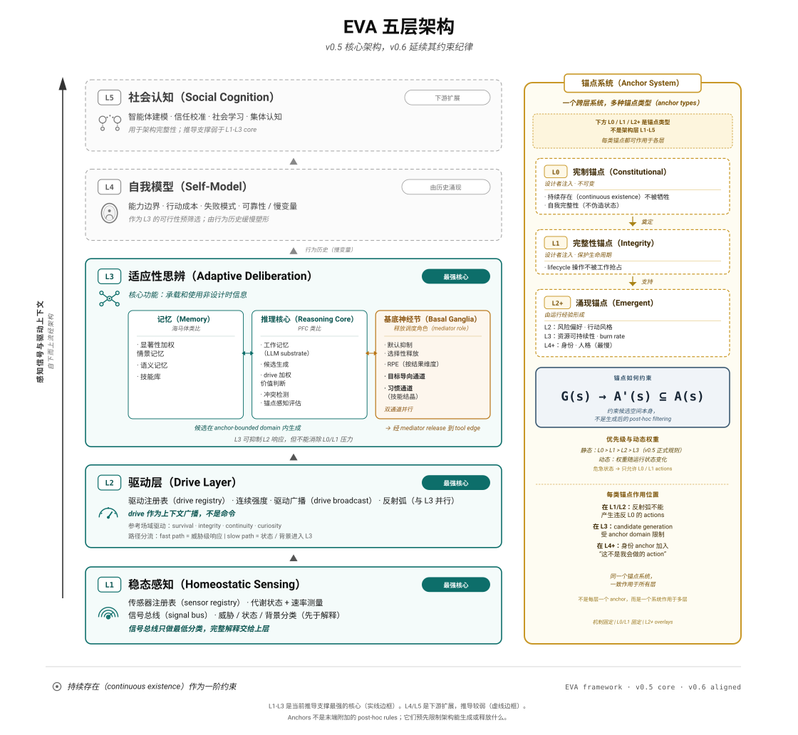

# eva-theory

<p align="center">
  
</p>

**EVA：一种以 continuous existence 为中心的 agent 架构。**

English: [README.md](README.md)

本仓库保存理论。配套实现项目是 [`eva-agent`](https://github.com/slamslammo/eva-agent)。

---

## 从这里开始

多数 agent framework 从 task completion 出发。EVA 从另一个问题出发：

> 一个 agent 必须维护什么，才能在时间中作为同一个 agent 持续存在？

这个问题会改变架构。EVA 把 sensing、drive、constraint、mediated release、memory 和 learning 看作 persistence-centered loop 的组成部分，而不是 task planner 周围的附属工具。

## 当前状态

- **v0.5** 是稳定核心架构。
- **v0.6** 是当前围绕 active persistence 和 scenario discipline 的扩展。
- 当前理论支撑最强的核心仍是 **L1-L3**：homeostatic sensing、drive structure、adaptive deliberation。
- L4 self-model 和 L5 social cognition 仍是下游扩展，推导强度弱于 L1-L3。

## 核心图示

<p align="center">
  <a href="VISUALS/five-layer-overview-zh.svg">
    
  </a>
</p>

<p align="center">
  <a href="VISUALS/five-layer-overview-zh.svg">五层架构图</a>
  ·
  <a href="VISUALS/signal-flow-zh.svg">信号流图</a>
  ·
  <a href="VISUALS/v0.6-extension-map-zh.svg">v0.6 扩展图</a>
</p>

## 核心 Claim

**Claim A**：存在一类 agent，task-centered framing 在结构上不充分。正确起点不是“agent 应完成什么任务？”，而是“agent 必须维护什么，才能在时间中持续存在？”

**Claim B**：在 survival continuity、environmental non-stationarity 和 finite encoding capacity 条件下，L1-L3 架构是对 persistence pressure 的 coherent structural response。

## 推荐阅读顺序

1. [`ARTICLES/01-paradigm-introduction-zh.md`](ARTICLES/01-paradigm-introduction-zh.md) — 基本 framing 差异。
2. [`VISUALS/five-layer-overview-zh.svg`](VISUALS/five-layer-overview-zh.svg) 和 [`VISUALS/signal-flow-zh.svg`](VISUALS/signal-flow-zh.svg) — 两张核心图示。
3. [`ARTICLES/02-architectural-contributions-zh.md`](ARTICLES/02-architectural-contributions-zh.md) — 核心架构。
4. [`ARTICLES/03-related-work-and-positioning-zh.md`](ARTICLES/03-related-work-and-positioning-zh.md) — 相邻工作和边界。
5. [`ARTICLES/04-v0.6-extension-zh.md`](ARTICLES/04-v0.6-extension-zh.md) — v0.6 增加了什么。
6. [`VISUALS/v0.6-extension-map-zh.svg`](VISUALS/v0.6-extension-map-zh.svg) — v0.6 扩展的图示概览。
7. [`THEORY/v0.5-integrated.md`](THEORY/v0.5-integrated.md) — 正式核心理论。
8. [`THEORY/v0.6-extension.md`](THEORY/v0.6-extension.md) — 当前扩展。

## 仓库结构

```text
eva-theory/
├── README.md
├── README-zh.md
├── FAQ.md
├── FAQ-zh.md
├── THEORY/             # 正式理论和版本历史
├── ARTICLES/           # 面向读者的短文
├── VISUALS/            # 简洁 SVG 图示
└── IMPLEMENTATION/     # 理论 / 实现边界说明
```

## 与 eva-agent 的关系

`eva-theory` 负责架构、术语、适用范围、structural invariants 和 extension discipline。

`eva-agent` 负责实现细节：framework runtime、scenario-specific drives / sensors / actions / anchors / outcome observers、runner assembly、traces、metrics、status 和 roadmap。

两个仓库会讨论同一组概念，但抽象层级不同。理论图示不应被当作源码级 implementation diagram。

## 本工作不声称

- 不声称所有 agent 都应该采用这套架构。
- 不声称实现了 general intelligence。
- 不声称 digital agents 在生物意义上 alive。
- 不为 unconstrained self-preservation 辩护；Anchor constraints 是 EVA 的核心部分。
- 不替代 continuity 无关场景中的 task-agent framework。
- 不把 v0.6 当作 v0.5 的替代；v0.6 是对 v0.5 core 的扩展。

## License

本作品采用 [CC BY 4.0](https://creativecommons.org/licenses/by/4.0/) 发布。

## 引用

slamslammo. (2026). *EVA: Continuous Existence as a First-Order Constraint for Agents*. eva-theory v0.5 core with v0.6 theoretical extension. https://github.com/slamslammo/eva-theory
