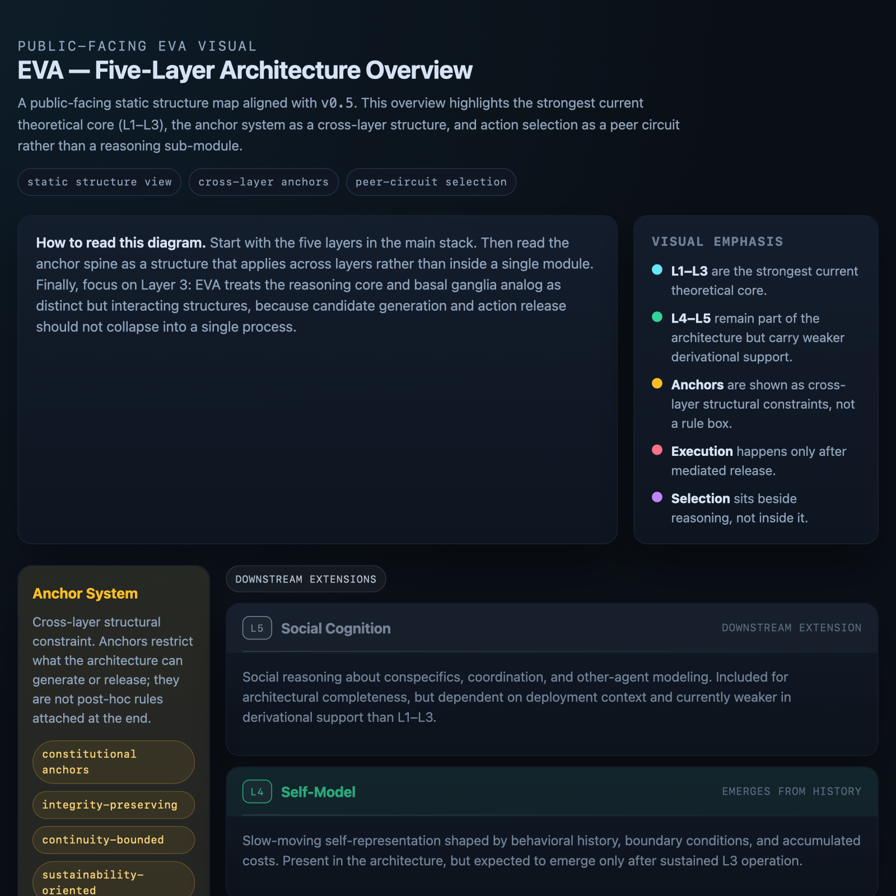
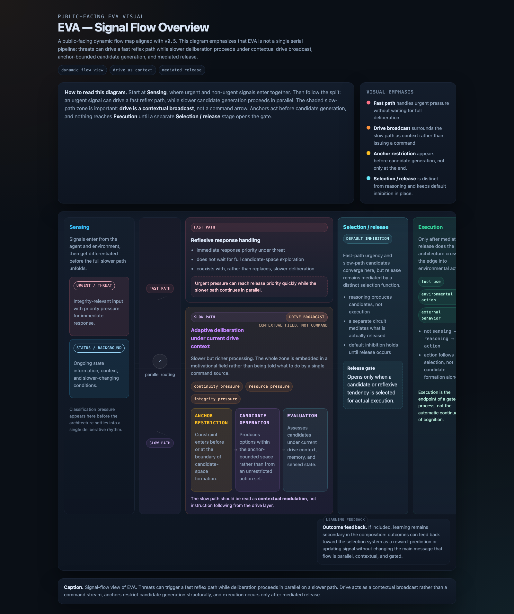

# eva-theory

**EVA: An architecture for agents centered on continuous existence.**

This repository contains the theoretical framework for EVA. The reference implementation (`eva-agent`) is under active development and will be published separately. See the "Relationship to Implementation" section below for the current correspondence and timeline.

---

## What This Is

Most AI agent architectures are organized around **task completion**. Memory serves recall, reasoning serves planning, tools serve execution, and the agent's lifecycle is bounded by the task boundary. Survival, continuity, and self-integrity are either assumed away or treated as peripheral concerns.

This repository develops a different paradigm: **an agent architecture where continuous existence is the first-order constraint**, and other capabilities are understood relative to that constraint.

This is not a proposal for "better agents." It is a proposal for a different kind of agent—one whose reason for existing is not to serve tasks, but to persist, and to grow through persistence.

## About the Name

EVA is derived from the Hebrew name *Chava* (חַוָּה), meaning "life" or "she who gives life"—the origin of the English name Eve. The name marks the project's central commitment: to treat continuous existence as a foundational design concern rather than a philosophical afterthought. We do not claim our agents are alive in any biological sense. The name signals the paradigm shift the project is centered on.

## Two Claims

This work makes two distinct claims, kept together rather than separated.

**Claim A (paradigm claim)**: There exists a meaningful class of agents for which the task-centered framing is structurally insufficient. For such agents, the correct starting point is not "what task should the agent complete?" but "what must the agent maintain in order to persist as the same agent over time?"

**Claim B (structural claim)**: Under three operating conditions—survival continuity, environmental non-stationarity, and finite encoding capacity—a layered architecture consisting of homeostatic sensing (L1), drive structure (L2), and adaptive deliberation (L3) is a structurally coherent response. Two further layers, self-model (L4) and social cognition (L5), are proposed as downstream extensions with explicitly weaker derivational strength.

## Core Contributions

Within the framework, four engineering contributions distinguish this paradigm from existing agent frameworks:

1. **Drive as continuous contextual broadcast, not instruction.** The drive layer broadcasts its state continuously; the reasoning layer operates within this state rather than receiving commands from it. Argued as the coherent solution to cross-system coordination in an architecture without a central controller.

2. **Anchor as pre-generative structural constraint, not post-hoc rule.** Anchors restrict the domain over which candidate actions are generated: `G(s) → A'(s) ⊆ A(s)`. Unlike rules that filter after generation, anchors cannot be reasoned around.

3. **Explicit drive injection rather than emergent drive formation.** Under the instrumental convergence hypothesis, drives will emerge in sufficiently capable systems whether designers intend them to or not. Explicit injection makes drives auditable and constrainable; emergent drives do not. We choose explicit.

4. **Basal ganglia analog as independent peer circuit, not reasoning sub-module.** Action selection and habit formation run parallel to deliberation, not within it. This preserves default inhibition as structure rather than policy, separates selection from justification, and enables emergent skill crystallization.

## Scope

The framework applies to agents operating under three conditions:

- **C1. Survival continuity requirement** — the agent's value comes from its continuous existence
- **C2. Environmental non-stationarity** — the environment's statistical structure changes over time
- **C3. Finite encoding capacity** — no finite design-time specification can cover all future states

The framework is **not intended for**:

- One-shot task agents
- Fully stationary environments
- Systems where continuity is irrelevant
- Benchmark settings where repeated reset is costless

For such systems, this architecture is unnecessary overhead.

## Repository Structure

```text
eva-theory/
├── README.md                        # This file
├── LICENSE                          # CC BY 4.0
├── index.html                       # Repository entry page for public-facing visuals
├── THEORY/
│   ├── CHANGELOG.md                 # Version-by-version substantive changes
│   ├── v0.1-initial.md
│   ├── v0.2-expanded.md
│   ├── v0.3-scoped.md
│   ├── v0.4-claim-structured.md
│   └── v0.5-integrated.md           # Current stable version
├── ARTICLES/
│   ├── README.md                    # Reader guide and article index
│   ├── 01-paradigm-introduction.md  # Introductory paradigm article
│   └── 02-architectural-contributions.md # Engineering-oriented companion article
├── VISUALS/
│   ├── README.md                    # Visual index and public-facing diagrams
│   └── previews/                    # Static preview images for README and landing page
├── DISCUSSIONS/
│   └── 01-route-selection.md
└── IMPLEMENTATION/
    └── eva-agent-correspondence.md  # Map from theory to reference implementation
```

## Current Version

The current stable theoretical document is **v0.5** (`THEORY/v0.5-integrated.md`).

v0.5 integrates the structural contributions of v0.4 (Claim A/B separation, anchor formalization, epistemic layering) with the sharp core of v0.3 (drive as context, LLM as Level 3 cultural carrier, peer circuit necessity). It marks the transition from "theory development" to "theory publication" phase.

For a shorter, reader-oriented entry point, start with `ARTICLES/01-paradigm-introduction.md`. For article navigation and public-facing visuals, see `ARTICLES/README.md` and `VISUALS/README.md`.

See `THEORY/CHANGELOG.md` for what changed at each version.

## Epistemic Transparency

Not all claims in this work rest on the same evidential basis. The document explicitly separates:

- **Level A** — established science (used as background, not contribution)
- **Level B** — theoretical hypotheses (acknowledged as hypothetical: instrumental convergence, dynamic kinetic stability, timescale mismatch)
- **Level C** — engineering contributions of this work (the substantive content)

Readers who disagree with specific Level B claims can still evaluate Level C contributions on their own merits.

## Relationship to Implementation

This theoretical framework is paired with an active implementation project named `eva-agent`. As of April 2026, `eva-agent` has completed Steps 0–2 (lifecycle, external sensing, minimum integrity pressure response) and demonstrated stable long-running operation on Linux. L3 architecture development is in progress.

The `eva-agent` repository is not yet publicly released. It will be published in the coming months, after a minimum viable L3 prototype is in place.

Until `eva-agent` is publicly released, `IMPLEMENTATION/eva-agent-correspondence.md` provides a high-level mapping from theoretical layers to current implementation status, without disclosing implementation details. The theory is not speculative architecture—it describes a system under active construction.

For notifications when `eva-agent` is released, watch this repository.

## What This Work Does Not Claim

- Not a claim that this is the only possible architecture for persistent agents
- Not a claim that this architecture achieves general intelligence
- Not a proposal for a specific implementation benchmark
- Not a critique of existing agent frameworks (they solve different problems)
- Not a claim that digital agents are "alive" in any biological sense
- Not a claim that continuity of existence justifies unconstrained self-preservation — L0/L1 anchors explicitly prevent this

## How to Read

- **Shortest entry**: `ARTICLES/01-paradigm-introduction.md`
- **Short theory path**: this README plus Sections 1, 4, and 5 of `THEORY/v0.5-integrated.md`
- **Paradigm argument**: Sections 1–4 of `THEORY/v0.5-integrated.md` (Claim A)
- **Architectural derivation**: Sections 5–12 of `THEORY/v0.5-integrated.md` (Claim B)
- **Engineering contributions only**: Section 3.3 plus Sections 7, 8, and 11 of `THEORY/v0.5-integrated.md`
- **Reader guide**: `ARTICLES/README.md` and `VISUALS/README.md`

## Visuals

The repository includes two public-facing visuals for readers who want a quicker architectural overview before or alongside the full theory text:

- [Five-Layer Architecture Overview HTML](VISUALS/five-layer-overview.html) — start here for the static map of the five-layer architecture
- [Signal-Flow Overview HTML](VISUALS/signal-flow.html) — then use the same layered skeleton to see fast path, slow path, drive broadcast, anchor restriction, and mediated release in motion
- [Visuals landing page source](index.html) — repository entry page linking both visuals and their source materials

GitHub Pages is not currently available for this repository plan, so the previews below link to the repository HTML files rather than live rendered pages.

<p align="center">
  <a href="VISUALS/five-layer-overview.html">
    
  </a>
  <a href="VISUALS/signal-flow.html">
    
  </a>
</p>

## License

This work is released under [CC BY 4.0](https://creativecommons.org/licenses/by/4.0/). You are free to share and adapt the material with attribution.

## Citing

If you reference this work, please cite as:
slamslammo. (2026). *EVA: Continuous Existence as a First-Order Constraint for Agents*. eva-theory v0.5. https://github.com/slamslammo/eva-theory

## Status

- **Theory**: v0.5 stable
- **arXiv submission**: in preparation
- **Implementation (eva-agent)**: Steps 0–2 complete; L3 work in progress

---

*This is independent theoretical research. The framework is open to critique and refinement. Substantive feedback is welcome through GitHub issues.*
