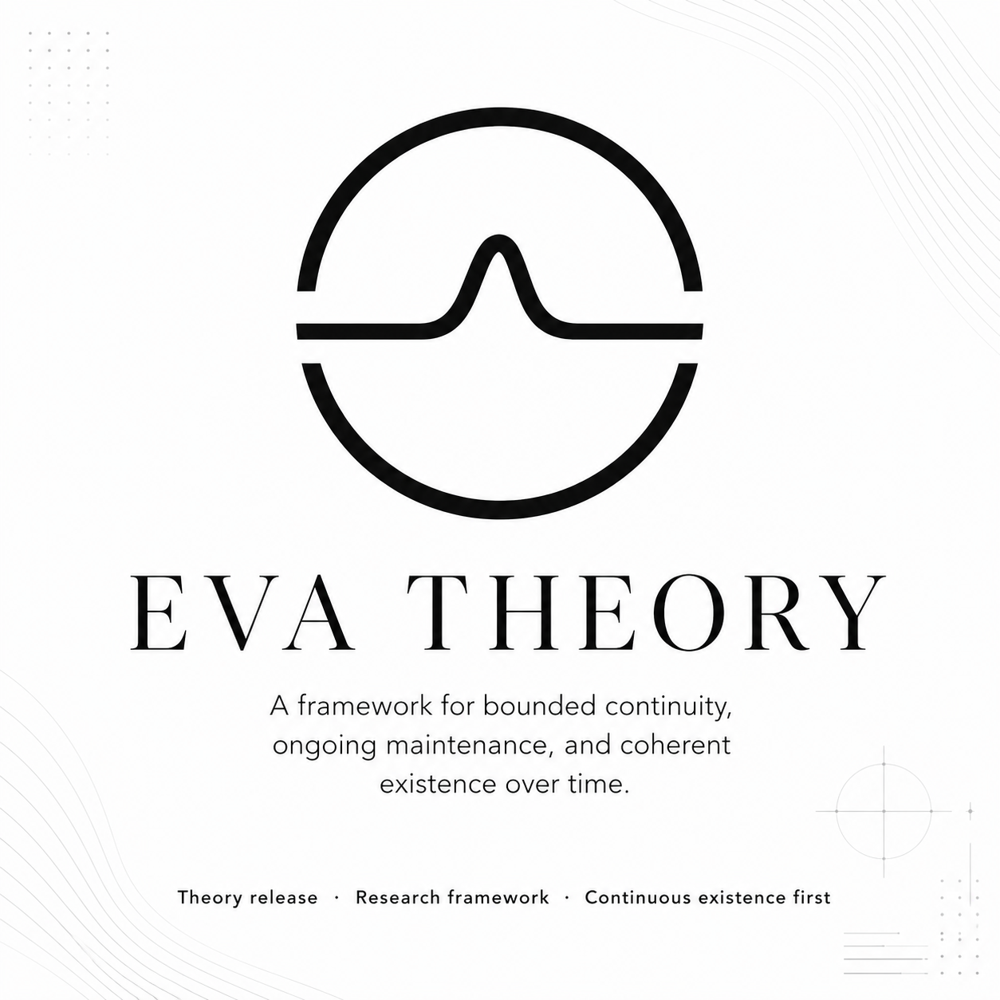
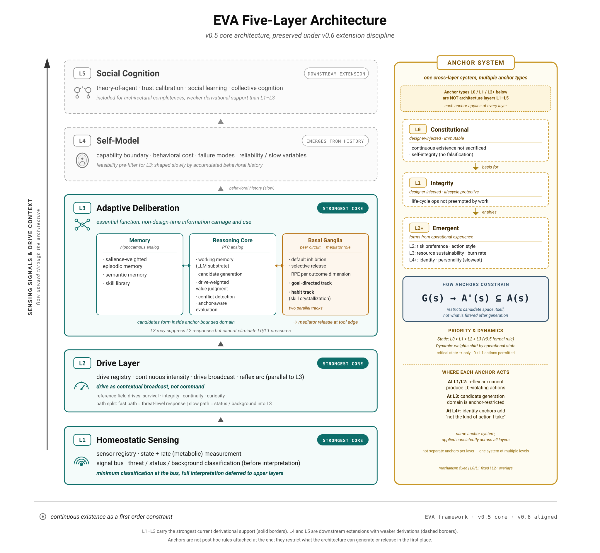

# eva-theory

<p align="center">
  
</p>

**EVA is an architecture for agents centered on continuous existence.**

中文入口: [README-zh.md](README-zh.md)

This repository contains the theory. The companion implementation project is [`eva-agent`](https://github.com/slamslammo/eva-agent).

---

## Start Here

Most agent frameworks start from task completion. EVA starts from a different question:

> What must an agent maintain in order to keep existing as the same agent over time?

That shift changes the architecture. EVA treats sensing, drive, constraint, mediated release, memory, and learning as parts of a persistence-centered loop rather than tools around a task planner.

## Current Status

- **v0.5** is the stable core architecture.
- **v0.6** is the current extension around active persistence and scenario discipline.
- The strongest theoretical core remains **L1-L3**: homeostatic sensing, drive structure, and adaptive deliberation.
- L4 self-model and L5 social cognition remain downstream extensions with weaker derivational strength.

## Core Diagrams

<p align="center">
  <a href="VISUALS/five-layer-overview.svg?raw=1">
    
  </a>
</p>

<p align="center">
  <a href="VISUALS/five-layer-overview.svg?raw=1">Five-Layer Overview</a>
  ·
  <a href="VISUALS/signal-flow.svg?raw=1">Signal Flow</a>
  ·
  <a href="VISUALS/v0.6-extension-map.svg?raw=1">v0.6 Extension Map</a>
</p>

## Core Claims

**Claim A**: For a meaningful class of agents, task-centered framing is structurally insufficient. The right starting question is not "what task should the agent complete?" but "what must the agent maintain to persist over time?"

**Claim B**: Under survival continuity, environmental non-stationarity, and finite encoding capacity, the L1-L3 architecture is a coherent structural response to persistence pressure.

## Read in This Order

1. [`ARTICLES/01-paradigm-introduction.md`](ARTICLES/01-paradigm-introduction.md) — the basic framing difference.
2. [`VISUALS/five-layer-overview.svg`](VISUALS/five-layer-overview.svg?raw=1) and [`VISUALS/signal-flow.svg`](VISUALS/signal-flow.svg?raw=1) — the two core diagrams.
3. [`ARTICLES/02-architectural-contributions.md`](ARTICLES/02-architectural-contributions.md) — the core architecture.
4. [`ARTICLES/03-related-work-and-positioning.md`](ARTICLES/03-related-work-and-positioning.md) — adjacent work and boundaries.
5. [`ARTICLES/04-v0.6-extension.md`](ARTICLES/04-v0.6-extension.md) — what v0.6 adds.
6. [`VISUALS/v0.6-extension-map.svg`](VISUALS/v0.6-extension-map.svg?raw=1) — a visual map of the v0.6 extension.
7. [`THEORY/v0.5-integrated.md`](THEORY/v0.5-integrated.md) — the formal core.
8. [`THEORY/v0.6-extension.md`](THEORY/v0.6-extension.md) — the current extension.

## Repository Structure

```text
eva-theory/
├── README.md
├── README-zh.md
├── FAQ.md
├── FAQ-zh.md
├── THEORY/             # Formal theory and version history
├── ARTICLES/           # Short reader-facing explanations
├── VISUALS/            # Simple SVG diagrams
└── IMPLEMENTATION/     # Theory / implementation boundary note
```

## Relationship to eva-agent

`eva-theory` defines the architecture, terminology, scope, structural invariants, and extension discipline.

`eva-agent` owns implementation details: framework runtime, scenario-specific drives / sensors / actions / anchors / outcome observers, runner assembly, traces, metrics, status, and roadmap.

The same ideas appear in both repositories, but at different levels. Theory diagrams should not be read as source-level implementation diagrams.

## What This Work Does Not Claim

- It does not claim every agent should use this architecture.
- It does not claim to achieve general intelligence.
- It does not claim digital agents are biologically alive.
- It does not justify unconstrained self-preservation; Anchor constraints are central to EVA.
- It does not replace task-agent frameworks where continuity is irrelevant.
- It does not treat v0.6 as a replacement for v0.5; v0.6 extends the v0.5 core.

## License

This work is released under [CC BY 4.0](https://creativecommons.org/licenses/by/4.0/).

## Citing

slamslammo. (2026). *EVA: Continuous Existence as a First-Order Constraint for Agents*. eva-theory v0.5 core with v0.6 theoretical extension. https://github.com/slamslammo/eva-theory
